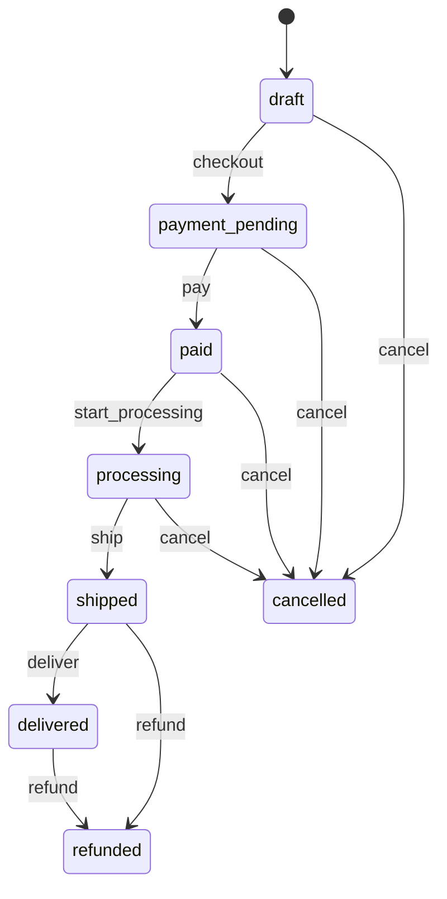

# Architecture — MyOil's multi-store shop

A multi-store e-commerce platform for lubricants (engine, industrial and agricultural oils) built on
**Symfony 7.4 LTS / PHP 8.4**, **MySQL 8**, and two isolated frontend stacks.

> **Visual diagrams:** open [`docs/diagrams/architecture.html`](docs/diagrams/architecture.html),
> [`docs/diagrams/db-schema.html`](docs/diagrams/db-schema.html) and
> [`docs/diagrams/pages.html`](docs/diagrams/pages.html) (navigation, page sketches, UI standards) in a browser.
> **Roadmap:** [`docs/PLAN.md`](docs/PLAN.md) · **Decision log:** [`docs/DECISIONS.md`](docs/DECISIONS.md)

## 1. Stack at a glance

| Concern | Choice |
|---|---|
| Backend | Symfony 7.4 LTS, PHP 8.4, Composer (PSR-4, `App\` → `src/`) |
| Database | MySQL 8, one shared schema for all stores, Doctrine ORM + Migrations |
| Messaging | Symfony Messenger: sync `command.bus` / `query.bus`, async Doctrine transport for emails and webhooks |
| Order lifecycle | Symfony Workflow (`state_machine`) for orders and payments |
| Server-rendered pages | Twig + Bootstrap 5.3 + jQuery 4 |
| Interactive pages | Vue 3.5 + PrimeVue 4.5.5 (Aura theme, MIT; pinned) + Tailwind CSS 4 |
| Icons | Lucide in both stacks; no emojis |
| Asset build | Vite 8 via `pentatrion/vite-bundle`, with three isolated entries (dev server on port 5174) |
| Local runtime | Laravel Herd (PHP, `*.shop.test` hosts) + Docker Compose (MySQL 8.4 on port 3307, Mailpit) |
| Quality | PHPUnit, PHPStan (level 8), deptrac, PHP-CS-Fixer, ESLint + Prettier, GitHub Actions |

## 2. Code layout and business-logic isolation

```
src/
  Domain/          pure PHP: Money, Pricing, Tax, Discount, Inventory, Shipping
  Entity/          Doctrine entities (Symfony standard location)
  Application/     commands, queries, handlers (Messenger), DTOs, ports (interfaces)
  Infrastructure/  Persistence (repositories), Tenancy, Workflow, Payment, Fixtures
  UI/              Http/Web (Twig), Http/Api (JSON), Http/Admin, Http/Webhook, Cli
```

- **Domain** contains the e-commerce rules: price and VAT calculation, discount application, stock
  validation and shipping cost. It imports **nothing** from `Symfony\` or `Doctrine\`. It works only on
  its own value objects (`Money`, `TaxRate`, `Quantity`, …) and is covered by plain unit tests.
- **Application handlers** are the thin bridge. Each one loads entities, maps them to domain inputs,
  asks the domain to calculate or decide, applies the workflow transition, and persists, all in one
  transaction. Controllers and console commands only build a command DTO and dispatch it.
- **Entities** are pragmatic Doctrine attribute entities in **`src/Entity`** (`App\Entity`), the Symfony
  standard location used by `make:entity`. The rules are pure; the entities are not. Getters return
  Domain value objects (for example integer cents become `Money`).
- **deptrac** enforces the direction of dependencies in CI:
  `UI → Application → Domain`, `Application → Entity → Domain`, and `Infrastructure → Application | Entity | Domain`.
  Domain depends on nothing.
- **Frontend code** is plain **JavaScript** (ES modules), with JSDoc types on the API layer.

## 3. Single-database multi-tenancy

- **One database, one schema.** Every tenant table (products, categories, variants, attributes,
  customers, orders, payments, coupons, shipping methods, …) has a non-null `store_id` FK. Business keys
  are unique **per store**, for example `(store_id, sku)`.
- **Several stores per country** are allowed. The demo runs three MyOil's shops in NL
  (Auto, Industrie, Agri & Marine), each with its own host, name, logo and colours.
- **Platform tables** have no `store_id`: `store`, `store_domain`, `staff_user`, `store_membership`,
  `country`, `tax_category`, `tax_rate`.
- **Resolution.** `TenantRequestListener` runs on `kernel.request` *before the firewall*:
  - **Storefront:** the `Host` header is looked up in `store_domain` (subdomains and custom domains
    both work).
  - **Admin (`admin.shop.test`):** the store comes from the staff member's store switcher (session),
    limited to stores in their `store_membership`.
  - **Unknown host:** 404. The system **fails closed**.
- **Automatic scoping.** A Doctrine `SQLFilter` (`TenantFilter`) appends `store_id = :storeId` to every
  query on entities implementing `TenantAwareInterface`. If no store is set it appends `1 = 0`, so
  nothing is returned. A `prePersist` listener stamps `store_id` on new entities and throws if there
  is no tenant.
- **Escape hatch.** `TenantContext::runAsPlatform(callable)` disables the filter explicitly. It is used
  by fixtures, platform CLI commands, and the super-admin's read-only "All stores" view.
- **CLI & async.** Commands take `--store=<code>`. Messenger messages carry a `StoreStamp` that a
  middleware turns back into the tenant context.
- **Users.** Customers belong to one store (the same email may exist in several stores). Staff are
  global users linked to stores by `store_membership(role)`. `is_super_admin` can see every store.

## 4. Order workflow state machine

Symfony Workflow, `type: state_machine`, marking stored in `Order::$state`.



**Guards** are `workflow.order.guard.<transition>` listeners. They delegate to pure domain policies and
block illegal changes:

| Transition | Guard |
|---|---|
| `checkout` | has lines, every variant active and in stock (`StockPolicy`), billing and shipping address set, shipping method allowed for the country |
| `pay` | a **captured** payment covers `total_gross` |
| `start_processing`, `ship`, `deliver` | staff role for the current store. `ship` additionally re-checks that the payment is captured, so an order can never ship while `payment_pending` (the state machine already has no such edge; the guard is defence in depth) |
| `cancel` from `paid`/`processing` | the full refund has gone through (the handler issues it through the gateway first) |
| `refund` (from `shipped`/`delivered`) | payment refunded (fully) |

**Cancel vs refund.** Before the order ships, the shop **cancels** it, and a full refund is issued
automatically first. After it ships, money goes back through **refund**, mainly after delivery.

**Status mapping.** Each workflow place maps to a customer label, an admin badge, a stock effect and an expected payment state:

| Place | Customer label | Admin badge | Stock | Payment |
|---|---|---|---|---|
| `draft` | Cart | grey "Draft" | not held | — |
| `payment_pending` | Awaiting payment | amber | **reserved** | `pending` / `authorized` |
| `paid` | Payment received | green | **deducted** | `captured` |
| `processing` | Being prepared | blue | deducted | `captured` |
| `shipped` | Shipped | indigo | deducted | `captured` |
| `delivered` | Delivered | teal | deducted | `captured` |
| `cancelled` | Cancelled | red | released (before pay) / restocked (after pay) | `cancelled` / `failed` (before pay), `refunded` (after pay) |
| `refunded` | Refunded | purple | restocked only when goods are returned (returns later) | `refunded` |

The mapping lives in one PHP enum (`OrderState`) with `label()` and `badge()` methods, and the Vue admin reads it from the API.

- Effects that change state (stock reservation or deduction, order number, price and VAT snapshots)
  are done by the **handler** in the same transaction as `$workflow->apply()`.
- Side effects (the `order_status_history` audit row, emails) run in `completed` listeners. Emails go
  through async Messenger.
- **Payments** have their own state machine: `pending → authorized → captured`, plus
  `failed`, `cancelled` and `refunded`. `payment.completed.capture` dispatches the order's `pay`
  transition.

## 5. Money, tax and pricing

- All amounts are **integers in minor units** (cents) of the store currency (one currency per store).
  VAT and coupon percentages are **`DECIMAL(5,2)`** (for example `21.00`, `5.50`). The domain reads them as
  exact decimal strings (never floats) and rounds each line half-up to cents.
- Catalog prices are entered **net**. Gross is always calculated by `Domain\Pricing`.
- VAT rates are **platform-wide** in `tax_rate(country, tax_category, rate, valid_from, valid_to)`,
  so rate changes over time are just new rows. The **store's country** decides the rate, behind
  `TaxRateResolverInterface`, so a destination-based resolver can be added later.
- At checkout, order lines **snapshot** SKU, names, net unit price, VAT rate, and line net, tax and
  gross, and orders snapshot addresses. History never changes.

- **B2B:** addresses capture `company` and `vat_id`. Reverse charge (0% VAT for EU business customers
  with a valid VAT ID) will be added later as a new `TaxRateResolverInterface` implementation.

## 6. Customers and addresses

- A registered customer always has **at least one billing and one delivery address**. They are required
  at registration ("delivery same as billing" is ticked by default), and deleting the last one of
  either kind is blocked.
- One `customer_address` row can serve both roles (`usable_for_billing`, `usable_for_shipping`). The
  customer points to a default billing and a default delivery address.
- **Guests** enter addresses at checkout only. They are snapshotted on the order and not kept.

## 7. Extension points (SOLID)

Every point below is an interface plus an autoconfigured tag plus a registry. You add a class; nothing
existing is edited.

| Interface | Implementations now | Selected by |
|---|---|---|
| `PaymentGatewayInterface` (`createCheckoutSession`, `handleWebhook`, `refund`) | `FakeGateway` (extends `AbstractPaymentGateway`) | `store.payment_gateway_code` → `PaymentGatewayRegistry` (tagged service locator) |
| `DiscountRuleInterface` | coupon percentage, coupon fixed amount | `supports()` on each rule |
| `ShippingCalculatorInterface` | flat, weight-based, free-over-threshold | `shipping_method.calculator` |
| `TaxRateResolverInterface` | store-country resolver | service alias |
| `ApiClient` (frontend API layer contract) | fetch client with session cookie and CSRF token | Vue `provide/inject` |

Shared behaviour sits in base classes: `AbstractPaymentGateway` (signature checks, money conversion),
`AbstractApiController` (JSON, validation, CSRF), and the Twig base layouts.

## 8. Frontend and style isolation

Vite builds **three independent entries**, and each Twig base layout loads exactly one of them:

| Entry | Source | Loaded only by | Pages |
|---|---|---|---|
| `bootstrap` | `assets/bootstrap/` (Bootstrap 5 SCSS + jQuery) | `templates/bootstrap/base.html.twig` | landing, about, FAQ, contact, terms, privacy, login, register, error pages |
| `storefront` | `assets/vue/storefront.js` + `tailwind.css` + PrimeVue | `templates/vue/base.html.twig` | catalog, product, cart, checkout wizard, customer account (Vue "islands" mounted per page) |
| `admin` | `assets/vue/admin.js` + `tailwind.css` + PrimeVue | `templates/vue/admin.html.twig` | admin SPA (vue-router) on `admin.shop.test` |

Isolation is enforced, not just agreed:

- A template extends **one** base layout. There is no global stylesheet.
- Tailwind 4 is imported with `source(none)` and explicit `@source` paths (`assets/vue`, `templates/vue`),
  so it never scans the Bootstrap templates. Its preflight reset ships only in the Vue bundles.
- ESLint `no-restricted-imports` blocks importing between `assets/bootstrap` and `assets/vue`.
- A CI step checks the built CSS: no Tailwind utilities or `--tw-*` variables in `bootstrap-*.css`, and no
  `.btn`, `.container` or `--bs-*` in `storefront-*.css` or `admin-*.css`.
- Design tokens (spacing, fonts, radii) live in one `tokens.json`, compiled into both SCSS variables
  and the Tailwind `@theme`. The tokens are shared; the CSS is not.
- **Per-store branding**: each store's `primary_color`, `accent_color`, `logo_url` and `favicon_url`
  are printed as CSS variables (`--brand-primary`, `--brand-accent` + generated shades) by both base
  layouts. Bootstrap maps them to `--bs-primary`, Tailwind `@theme` to `primary-*`, and PrimeVue Aura
  gets them at runtime. The admin keeps a neutral platform theme.
- **Light theme only** for now. Dark mode can be added later because every colour is already a variable.
- **UI language:** English. Every text goes through Symfony and Vue translation keys, and
  `store.default_locale` is ready for Dutch. Catalog translation tables are a later phase.
- **Images** are links (`https://` URLs) for products, logos and favicons. There is no upload yet.

## 9. Navigation

- **Storefront header:** top-level categories with mega-menus, search, account menu, mini-cart drawer,
  and a switcher to the other MyOil's shops. **Footer:** About, FAQ, Contact, Shipping info, Safety data
  sheets, Terms, Privacy.
- **Customer account:** Dashboard, Orders, Addresses, Profile & security.
- **Admin:**
  - *Main navigation* (daily work): Dashboard, Orders, Catalog (Products, Categories, Attributes),
    Customers (with a Contact messages tab), Coupons.
  - *Settings* (selected store): Store profile & branding (including the low-stock threshold), Domains,
    Shipping methods, Payment gateway, Staff & roles, Email notifications.
  - *Platform* (super-admin only): Stores, Countries & VAT rates, Tax categories, Staff users, System.

Page-by-page sketches are in [`docs/diagrams/pages.html`](docs/diagrams/pages.html). Every UI standard is
demonstrated on the dev-only UI kit pages `/ui-kit` (Bootstrap) and `/ui-kit/vue` (Vue).

## 10. UI standards and error handling

Both stacks implement the same behaviour. There is one helper per stack, and the API is the same.

| Standard | Rule |
|---|---|
| Toasts | Top-right (top-centre on mobile). Success and info close after 4 s; warnings and errors stay until closed. Max 3 visible. Server flash messages become toasts too |
| Form fields | Invalid → red border + icon + a short "what to do" message **under the field**. Checked on blur and submit, then live while typing. `*` marks required fields. Focus moves to the first error; long forms show an error summary. The server (Symfony Validator) is the source of truth |
| Confirmation | **Every destructive action** goes through the standard confirmation dialog. The title names the action and object, the body states the consequence, the safe button is on the left, and the red verb button is on the right. Esc means "safe". Severe platform actions require typing the name |
| Unsaved changes | Edit forms track "dirty" state. Leaving through in-app navigation opens the standard "Leave without saving?" dialog. Closing or reloading the tab uses the browser's native `beforeunload` prompt |
| Icons | **No emojis anywhere.** One library, **Lucide** (SVG): `lucide-vue-next` in Vue, `symfony/ux-icons` (`ux_icon('lucide:…')`) in Twig. PrimeVue's own icons are replaced in our wrapper components. One semantic icon map is shared by both stacks |
| Loading / empty | Skeletons for content, a spinner on the clicked button (disabled to prevent double submits), and empty states with one action |
| API errors | Always RFC 7807 `application/problem+json`, with `violations[]` for field errors (`ProblemJsonExceptionListener`); one shared client `assets/shared/http/api-client.js` does the automatic parts (419 retry, GET backoff, timeout, offline) and each stack reacts with its own toasts and dialogs |
| CSRF | Forms: Symfony form CSRF. JSON API: `X-CSRF-Token` header (token id `api`, printed in `<meta name="csrf-token">`, fresh via `GET /api/csrf-token`); missing or expired → 419 |
| Error handling | Every status has a defined reaction: 400, 401, 403, 404, 405, 409, 413, 419 (CSRF), 422, **429 with a `Retry-After` countdown**, 500 (with a reference code), 502, 503 and 504 (with retry and backoff), offline, timeout, and JS runtime errors. **Any other status** falls back to a generic 4xx or 5xx handling, so nothing goes unhandled |
| Rate limiting | Symfony RateLimiter on login, registration, password reset, contact form, coupon apply, checkout, storefront and admin APIs. Webhooks are protected by signature instead |
| Error pages | Branded Bootstrap pages: 404, 403, 419, 429, 500, 503, plus a neutral "store not found" page. Every response has an `X-Request-Id`, which is logged and shown as the reference code |

## 11. Branching strategy


| Branch | Purpose | Receives from |
|---|---|---|
| `test` (default) | Continuous integration: every feature PR lands here and the full CI suite runs | `feature/*` PRs |
| `stage` | Pre-production: deployed to staging for final QA | `test` |
| `production` | Live, tagged with SemVer | `stage`, `hotfix/*` |

Hotfixes branch from `production` and are merged back down to `stage` and `test`. None of the three
branches accept direct pushes; PRs need green CI and a review.
